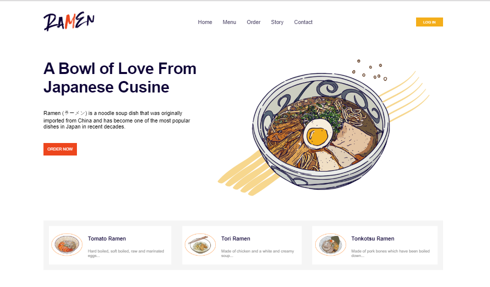

# Ramen-Restaurant-landing-page
> A anding page for Ramen Restaurant

## General info
The purpose of the project is to create a landing page for Ramen Restaurant. This is a challenge also put together by [Bahd Coder](https://twitter.com/bahdcoder). The project is a mobile reg pages for EVON. 
The design was provided by Bahd Coder via Figma, I developed it making sure it looked as close to the design as possible.

## Screenshots

## [Live Demo](https://ramen-restaurant-landing-page.netlify.app)

## Technologies
* HTML5
* CSS3
* Working with Figma
* vscode
* Git

## Features
* Responsive web desgn
* Mobile first approach
* Mobile menu toggle button

## Contact me
Feel free to contact me on [linkedin](https://www.linkedin.com/in/monday-ofem/) and [twitter](https://twitter.com/MondayOfem)
